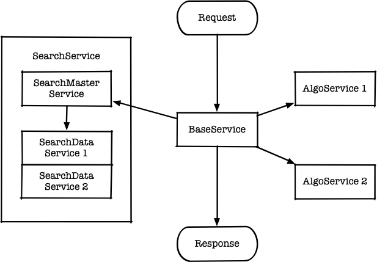

# FaceRecognitionService

一个人脸识别服务端项目，实现了人脸检测和人脸识别，并封装为了对外的 python 服务。可以部署在 CentOS 7 服务器上。适合监控场景下多人脸的视频流/图片的人脸采集和识别。

该项目包括除模型数据外的全部代码及完整的项目文档和测试文档，使用 GNU General Public License 开源协议。

## 软件文档

1. 项目计划
    1. 可行性分析文档
    2. 项目开发计划
2. 项目需求
    1. 需求文档
3. 项目设计
    1. 概要设计文档
    2. 详细设计文档
4. 项目开发
    1. 程序说明文档
    2. 冒烟测试文档
5. 项目测试
    1. 测试案例评审文档
    2. 测试分析报告
6. 项目部署维护
    1. 部署文档
    2. 维护文档

## 基础架构

项目分为 BaseService 和 AlgoService、SearchService 三个部分。其中 BaseService 负责对外组合请求和对外提供服务，AlgoService 负责人脸检测和人脸识别的深度学习推理，SearchService 用于存储人脸信息和搜索人脸特征值。BaseService 由 Python Flask 搭建，通过 RPC 调用 AlgoService 获得人脸特征值后再通过 http 接口调用 SearchService 搜索对应的人脸库，可以对外提供人脸注册、人脸删除和人脸识别三种接口；AlgoService 的算法部分由 C++ 实现，是一个使用 TensorRT/Caffe 作为深度学习推理引擎，辅以 CUDA 优化的异构计算程序，需要部署在包含 GPU 的设备上；AlgoService 的服务部分由 Python 实现，通过 pybind11 调用底层算法；SearchService 以 Open Distro for Elasticsearch 为基础开发搭建成一个集群，集群包括基本的 master 和 data 节点，实现了基本的分布式向量检索功能。

在 AlgoService 中，人脸检测使用 MTCNN 实现以支持复杂的多人脸视频流和降低服务器成本；人脸识别则使用 FaceNet 实现。

